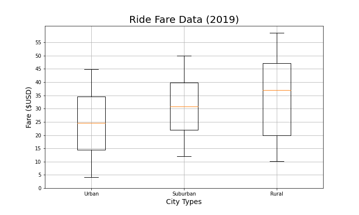
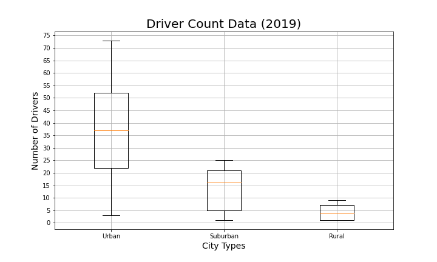

# PyBer Ride Share Analysis
## Overview of the analysis
Company PyBer wants to analyze ride sharing data from various city types. After the initial analysis, the new challenge was to create a multi-line graph showing the total weekly fares for each city type. This new analysis requires grouping the data based on the "type" and "date" to create a new DataFrame. Additionally, the "resample()" method was used to combine the data into weekly bins. Overall, the new challege gave PyBer another visual chart showing the weekly fares from January to April based on the city type. 

## Result
The bubble chart below compares the total number of rides and the average fare for each city type. The size of the bubble represents the number of drivers. The following analysis can be made with the chart.
  - Urban cities have the most number of rides; rural cities have least
  - Urban cities average ride fare is lowest
  - There are more drivers in Urban cities than Suburban and Rural

These box-and-whisker plots shows the same analysis but in a different view. Additionally, the plots also shows the measure of central tendency for each category.

| Ride Count Data | Ride Fare Data | Driver Count Data|
| :---:  | :---: | :---:| 
|  |  |  |

| % of Total Fares by City | Ride Fare Data | Driver Count Data|
| :---:  | :---: | :---:| 
|  |  |  |
