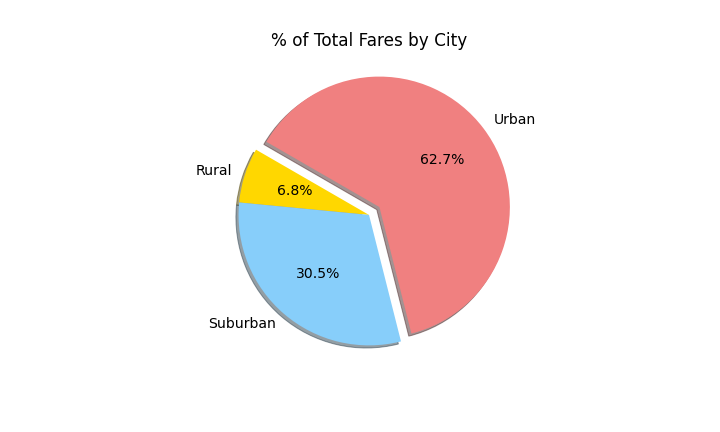
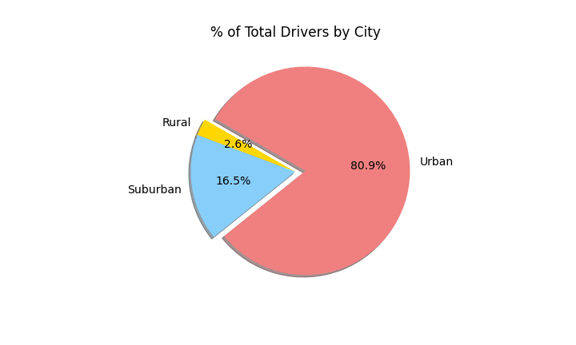
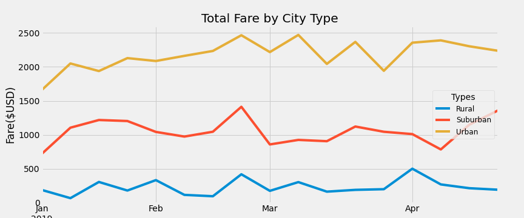

# PyBer Ride Share Analysis
## Overview of the analysis
Company PyBer wants to analyze ride sharing data from various city types. After the initial analysis, the new challenge was to create a multi-line graph showing the total weekly fares for each city type. This new analysis requires grouping the data based on the "type" and "date" to create a new DataFrame. Additionally, the "resample()" method was used to combine the data into weekly bins. Overall, the new challege gave PyBer another visual chart showing the weekly fares from January to April based on the city type. 

## Result
The bubble chart below compares the total number of rides and the average fare for each city type. The size of the bubble represents the number of drivers. The following analysis can be made with the chart.
  - Urban cities have the most number of rides; rural cities have least
  - Urban cities average ride fare is lowest
  - There are more drivers in Urban cities than Suburban and Rural

These box-and-whisker plots shows the same analysis but in a different view. Additionally, the plots also shows the measure of central tendency for each category.

| Ride Count Data | Ride Fare Data | Driver Count Data|
| :---:  | :---: | :---:| 
|  |  |  |

The following pie chart shows the percent breakdown of each category by city type. In summary, Urban city type has the most drivers, the most ride, and generate the most revenue.

| % of Total Rides by City | % of Total Fares by City | % of Total Drivers by City|
| :---:  | :---: | :---:| 
|  |  |  |

When looking at the weekly timeframe from January through April, it is clear that Urban cities generate the most revenue at all times. Also, during this stretch of the data, at no point did any of the city type overtake or undertake another. 

## Summary and considerations
The data shows that Urban city type dominated the market. This is not a surprise as more people live in urban areas than rural. Based on the data, these would be some recommendations for PyBer:
   - Continue to invest in Urban cities as they generate the most fare
   - Increase suburban drivers to meet demands
   - Explore possible solutions in bringing down fare cost for suburban and rural rides

To further understand the data more, it would be wise of PyBer to explore the net profit of each city type. This would help to decide whether rural cities are worth the invested time and resource. Another thing to factor in is the possibility of rural residents not using ride share because the cost is too high. A survey on this would yield some possible explanation. 
